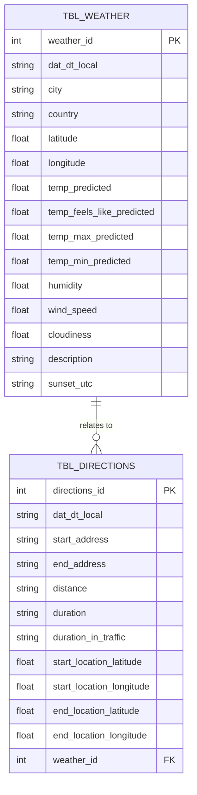

# 🧠 Contexto do desafio

A Zebrinha Azul é uma startup inovadora que se destaca no mercado por sua expertise em lidar com dados de clima e tráfego. A empresa fornece soluções avançadas para otimizar operações logísticas e proporcionar relatórios para clientes de diversos setores. Como um(a) engenheiro(a) de dados, sua missão é desenvolver um sistema robusto e escalável para integrar, processar e analisar os dados de clima e tráfego que a Zebrinha Azul coleta.

# Solução proposta

Criar um web app com uma interface simples e familiar ao usuário. Para ter a rota otimizada e os clima, serão extraídos dados da API da `OpenWeather` e `Google Maps`. 

O usuário terá duas tarefas dentro do web app:
1. Inserir a cidade e país que deseja obter os dados de clima;
2. Inserir a localização de origem e localização de destino, além do modo de viagem, que pode ser: driving, walking, bicycling e transit. Essas opção são disponibilizadas pela API do Google Maps.

Por fim, é gerado os dados de clima em formato de cards e o mapa da rota, com opções de zoom e movimentação do mapa, na interface do Google Maps.

# 1. Extração de Dados

A API da OpenWeather pode ser obtida com a `Current Weather Data`, na página API, ao criar a chave de acesso e inserir a chave no link da API. 

Para obter a chave do Google Maps, é preciso crair um projeto no GCP e ativar as API´s listadas abaixo.

- Directions API
- Geocoding API
- Maps JavaScript API

Em seguida, devemos baixar o pacote `googlemaps` para usar os serviços via Python.

Como plano de acesso da chave para ambas API´s, cada uma possui um plano diferente:

- OpenWeather: A plataforma não permite cadastrar usuários no plano grátis. Portanto, uma alternativa é o compartilhamento da API ou disponibilizá-la em um servidor próprio ou serviço de storage. A primeira opção é a menos segura, uma vez que qualquer transporte de mensagem pode ser vazado. A segunda opção é mais segura, uma vez que técnicas de segurança são aplicadas em provedores de nuvem ou em servidores próprios, como VPN.
- Google Maps: O usuário deve ser cadastrado no projeto, ter as roles de leitura da API para ler os dados ao fazer requisições. A chave de acesso pode ser disponibilizada por um usuário de serviço, que disponibiliza a chave criptografada.

Escolhas de dados extraídos

**Weather**

temp_predicted, temp_feels_like_predicted, temp_max_predicted, temp_min_predicted, humidity, wind_speed, description

Esses foram os dados extraídos. Considerei como os mais importantes porque descrevem todas as informações de clima que afetam em como a logística deve ser feita.

**Directions**

distance, duration, duration_in_traffic

Esses foram os dados extraídos. Considerei como os mais importantes porque poderemos saber a distância em quilômetros, duração em minutos ou horas e o tempo ocupado no trânsito.

# 2. Limpeza e Transformação:

Tratamentos realizados:

**extract_weather_data.py**:  
- unity_transform: Transforma valores percentuais em suas representações decimais.  
- create_weather_index: Cria coluna de índice. Cada vez que uma nova instância for criada, a função é chamada em sequência
- utc_transform: Altera a data e hora UTC para a data e hora local, armazenando o valor em uma nova coluna `local_time`.

# 3.Modelagem de dados

O clima de cada cidade deve fazer referência de uma ou mais direções.

# 4. Integração com o Banco de Dados

Para garantir a integridade entre os dados, no momento que uma nova consulta é feita na API, a ocorrência é salva no banco e os dados são extraídos. A última ocorrência de ambas as tabelas receberá o mesmo ID, e assim as informações poderão ser relacionadas.

# 5. Visualização

Há cards com informações do clima e rota, seguido de um gráfico abaixo com a melhor rota detectada pela API Google Maps.

**Nota**: Por um erro de incompatibilidade do Streamlit e a biblioteca pyarrow, não consegui plotar o gráfico da rota. Para consertar esse problema, é necessário criar um ambiente virtual com a versão Python 3.8. Devido a falta de tempo, não consegui remanejar o projeto para o ambiente e versão da linguagem.

# Como usar o projeto?

Baixe todos os arquivos com: git clone https://github.com/carlosr-henriques/desafio-DNC.git

Além do plano de acesso às chaves da API, devem ser baixados os seguintes pacotes:

- pip install pandas
- pip install sqlalchemy
- pip install googlemaps
- pip install python-dotenv
- pip install streamlit
- pip install geopy
- pip install pytz
- pip install timezonefinder
- pip install streamlit-folium
- pip install folium

Para acessar a aplicação streamlit, use o terminal, acesse a pasta do projeto pelo terminal e digite o código `streamlit run app.py`.

